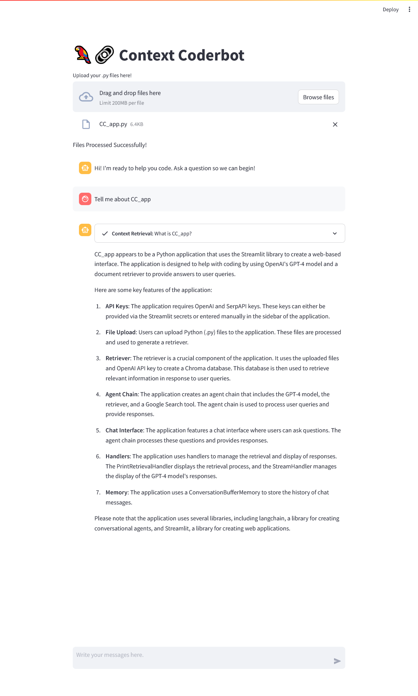
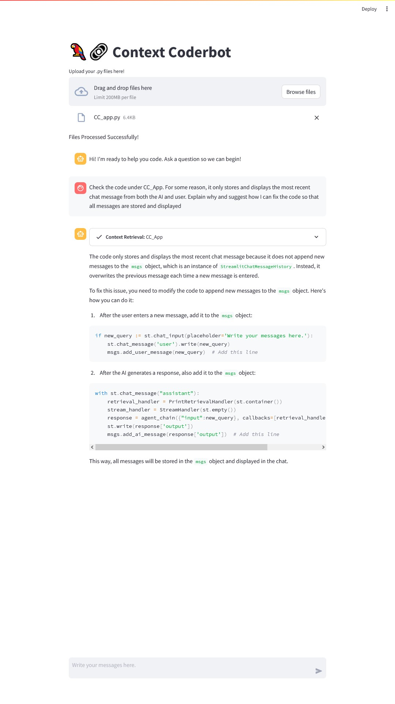
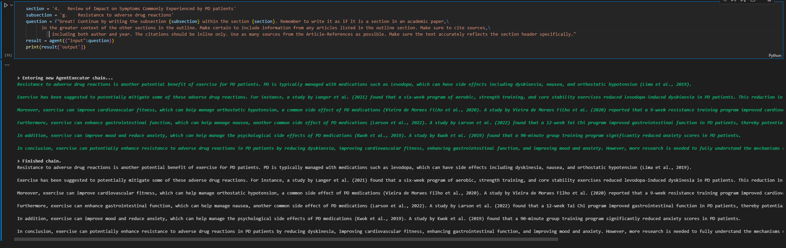
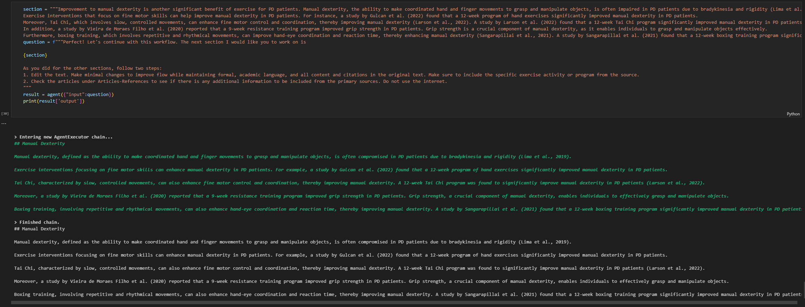

# Contextual Writing Assistant

A LangChain and OpenAI API powered multi-purpose assistant!

## Project Overview

This project aims to explore the benefits to performance on code and text generation tasks by LLMs with the implementation of Retrieval Augmented Generation (RAG). RAG allows models to leverage external knowledge effectively, making them more versatile and capable of producing high-quality text that aligns better with the given context or query. This external knowledge base usually exists in the form of a vectorstore. The user provides files, which are loaded and vectorized using LLM embeddings. When a query is passed to the LLM or chatbot, it is itself vectorized. This input vector is used to query the vectorstore, and by choosing stored vectors from the vectorstore by a similarity metric, the LLM gains access to user-provided context when generating its response.

In this repository, this technique has been applied to two domains: code generation and academic writing. The end goal is achieved by using LangChain as the means for creating a conversational `Agent`, which is given access to tools such as google search and retrievers for the vectorstore databases. The `Agent` handles gathering appropriate context and passing it to the LLM along with the query.

## Context Coder

One domain we can imagine applying RAG to is in code generation. LLMs have started to show promising performance in code generation tasks, but they are not often aware of the intimate details of specific public modules, and they are definitely not aware of user developed code. However, if we create a knowledge base from code files, the LLM can be provided this context. This has been implemented and can be run as a local streamlit app, found in this repo! Simply fork the repo and create an environment from the .yml file, navigate to the directory, provide the path to your files, and in your terminal of choice run `streamlit run CC_app.py`. Even better, if you have an OpenAI API key and a SerpAPI key, you can try it out [here](https://contextcoder-mattlegro.streamlit.app/), hosted on Streamlit's Cloud Service (Note that streamlit has a upload limit of 200mb, and you have to upload indivdual files, not a directory)! 

Why say more? What does Context Coder have to say, when asked about itself?

Pretty cool. Now, we can see it is more than capable of understanding code it has access to. But how well can it generate code? When I first started up the app, only the most recent messages were being displayed. So, I uploaded the CC_app.py file and asked how to fix it.

Sure enough, the suggested fix worked. I have used it in the `AgenticRag_Coder` notebook for help in other instances when writing the app, and I will certainly use it to speed up future projects.

## Context Writer

A second domain where LLMs are performing well is content generation. They have proven capable of writing on broad subjects or on topics well within the range of general knowledge, but technical details can be a challenge. In this case, a vectorstore is created containing the contents of primary source scholarly articles, specifically related to the impact of various forms of exercise on Parkinson's Disease patients' symptoms. Then, a basic outline, which can be found [here](paper_files/outline.pdf), was provided. By asking the LangChain Agent to generate specific sections, as

a rough first draft was generated. To improve the way the language flowed, an editing pass was done.

In the same way, it generated an abstract, title, introduction, and conclusion. Lastly, it created a reference list in AMA format, organized them in order of appearance in the paper in the references list, then verified all references by looking them on google scholar. All the generation history can be found in the notebook `AgenticRAG_PaperWriter`. The final draft itself, a continuing medical education (CME) review on the impact of exercise on Parkinson's symptoms, can be found [here](paper_files/draft.pdf). 

## Future Plans

Continuing to work on improving the Context Coder! I expect to improve it as becomes necessarily apparent when using it to work on other projects. I'm experimenting with implementing [codeinterpreter-api] as a tool or in a multi-agent framework to allow the `Agent` to be able to test generated code. A next step for general improvement is improving prompting strategy. Also, a great blog on [LangSmith and Lilac](https://blog.langchain.dev/fine-tune-your-llms-with-langsmith-and-lilac/) was released recently which seems like, if you worked with a codebase long enough, you could use it to generate a dataset of good responses for finetuning the llm to working with your code, in addition to having RAG.